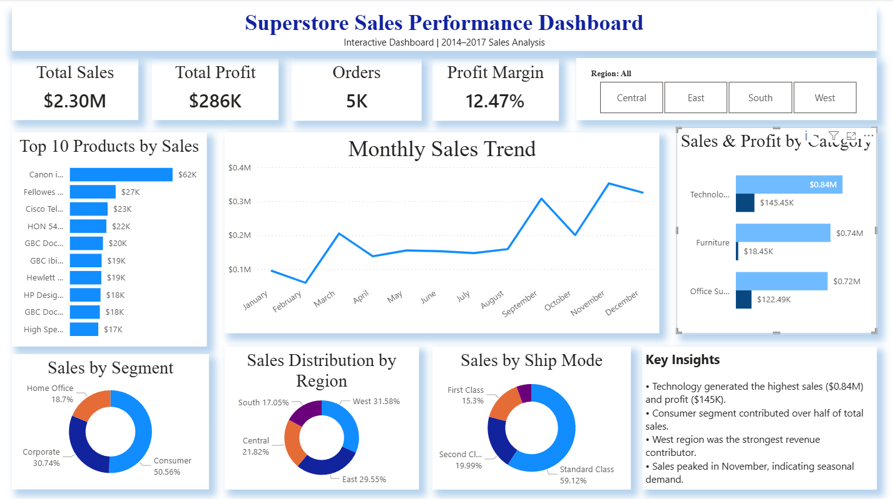

# FUTURE_DS_01 – Business Sales Performance Analytics

This project was completed as part of the **Data Science & Analytics Internship** at **Future Interns** under Task 1 – Business Sales Performance Analytics.

## Project Overview

This project focuses on analyzing business sales performance using Power BI to uncover revenue trends, product performance, profitability patterns, and regional sales insights.

The objective was to transform raw sales data into an interactive dashboard that supports business decision-making through clear visualizations, key performance indicators, and actionable recommendations.

---

## Task Objective

Analyze business sales data to identify:

- Revenue trends over time
- Top-selling products
- High-performing product categories
- Regional sales performance
- Customer segment contribution
- Key business insights for decision-making

---

## Tools Used

- **Microsoft Power BI** – Dashboard design, KPI tracking, and interactive visualizations
- **Microsoft Excel / CSV** – Data review and source dataset handling

---

## Dataset

**Superstore Sales Dataset**  
Source: Kaggle

Dataset Link:  
https://www.kaggle.com/datasets/vivek468/superstore-dataset-final

---

## Dashboard Overview

This dashboard presents a comprehensive analysis of business sales performance using historical sales data to identify trends, profitability drivers, and strategic business opportunities.

### Dashboard Features

- **KPI Cards**
  - Total Sales
  - Total Profit
  - Total Orders

- **Visual Analysis**
  - Sales Trend Over Time
  - Sales by Category
  - Profit by Region
  - Top Products by Sales
  - Customer Segment Analysis

- **Interactive Features**
  - Region Filter
  - Category Filter
  - Segment Filter
  - Year Filter / Slicers

---

## Dashboard Preview

---

## Key Insights

### 1. Revenue Trend Analysis
Sales showed noticeable fluctuations across different time periods, with peak sales during specific months, indicating seasonal demand patterns and strong revenue periods.

### 2. Category Performance
- **Technology** generated the highest overall sales among all categories.
- **Furniture** contributed strong revenue but lower profit margins compared with other categories.

### 3. Regional Performance
Regional sales and profit performance varied significantly. Certain regions delivered higher profitability, while others showed comparatively weaker performance, highlighting opportunities for regional strategy improvement.

### 4. Top-Selling Products
A small group of products contributed a major share of total sales revenue. These products can be prioritized for inventory planning, promotion, and future sales strategy.

### 5. Customer Segment Analysis
Customer segment analysis showed that some segments generated significantly higher sales and profit contribution than others, helping identify the most valuable customer groups.

---

## Business Recommendations

Based on the analysis, the following recommendations are suggested:

- **Increase promotion of top-performing products** to maximize revenue growth.
- **Improve inventory planning** for high-demand products to prevent stock shortages.
- **Focus marketing efforts** on the most profitable customer segments.
- **Review low-performing regions** and optimize regional sales strategies.
- **Improve pricing and cost efficiency** in lower-margin categories to increase profitability.

---

## Files Included

- `FUTURE_DS_01.pbix` → Power BI Dashboard File
- `dashboard_screenshot.png.png` → Dashboard Preview
- `README.md` → Project Documentation
- `Sample - Superstore.csv` → Source Dataset

---

## Deliverable

A client-ready interactive Power BI dashboard presenting business performance metrics, visual insights, and actionable recommendations to support strategic business decision-making.

---

## Skills Demonstrated

- Business Analytics
- KPI Analysis
- Data Cleaning
- Dashboard Design
- Data Visualization
- Insight Generation
- Performance Analysis
- Business Decision-Making using Power BI

---

## Outcome

This project demonstrates the practical use of Power BI for analyzing sales performance and converting raw business data into meaningful insights that can support data-driven decision-making.
